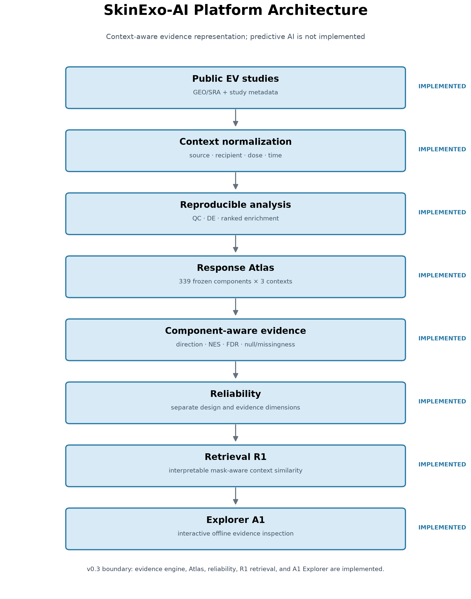
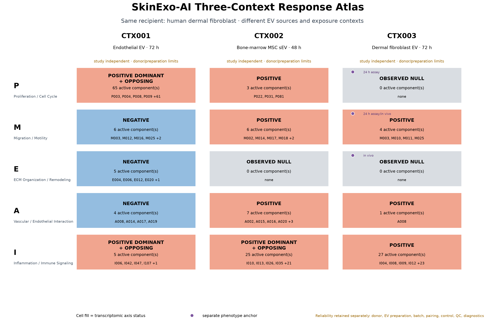

# SkinExo-AI: A Context-Aware Extracellular-Vesicle Response Platform

<p align="center"><strong>SKINEXO LAB</strong><br><sub>CONTEXT · EVIDENCE · RESPONSE</sub></p>

> **SkinExo-AI transforms isolated extracellular-vesicle studies into a context-aware response atlas that retrieves and explains conserved, context-dependent, discordant, and uncertain cellular responses.**

The implemented v0.3 platform combines a reproducible transcriptomic evidence engine, context normalization, a three-context Response Atlas, component-level comparison, explicit reliability metadata, interpretable retrieval, deterministic WHY explanations, and an offline interactive Explorer.

`3 verified contexts` · `339 response components` · `1,017 response records` · `offline Explorer`

## Quick links

- [Watch the final Demo Video](https://youtu.be/optVRKKDNec)
- [Read the Technical Report](submission/technical_report.md)
- [Explore the A2 product and launch instructions](app/README.md)
- [Review scientific reproducibility](docs/REPRODUCIBILITY.md)

Today, SkinExo-AI retrieves and explains **observed** responses. EV candidate screening, response prediction, and a Skin–EV Response Digital Twin are future work—not implemented product capabilities.



*Platform architecture. Evidence and reliability remain visible through retrieval and the Explorer; predictive AI is not implemented.*

## The Problem

Most EV studies are analyzed independently, although EV source, recipient system, dose, duration, and experimental design can materially change the observed response. Across the three analyzed human dermal fibroblast contexts, a single broad EV-response signature was **not supported**. SkinExo-AI therefore represents response evidence in its experimental context and preserves active, observed-null, not-tested, and uncertain states.

## What SkinExo-AI Does

```text
Public EV studies
        ↓
Reproducible transcriptomic analysis
        ↓
Context normalization
        ↓
Three-context Response Atlas
        ↓
Component-aware evidence and reliability
        ↓
Interpretable context retrieval
        ↓
Offline interactive Explorer
```

Implemented in v0.3:

1. reproducible transcriptomic evidence engine;
2. normalized context, response, component, phenotype, and reliability schemas;
3. a three-context Response Atlas;
4. mask-aware, component-level retrieval with deterministic explanations; and
5. a Streamlit Explorer that runs from tracked derived artifacts.

SkinExo-AI does not contain a trained predictive model or an agent.

## Key Result

The F2 Atlas contains **3 independent study contexts**, **339 response components**, and **1,017 context-component response records**.

| Axis | Three-context interpretation |
|---|---|
| P — Proliferation / Cell Cycle | Two-context shared component only; it does not extend to CTX003 |
| M — Migration / Motility | Context-dependent / discordant |
| E — ECM Organization / Remodeling | Null / not testable across the three-context comparison |
| A — Vascular / Endothelial Interaction | Context-dependent / discordant |
| I — Inflammation / Immune Signaling | Conserved broad axis with context-specific component structure |

**Broad universal EV response: NOT SUPPORTED.**



*Three-context Response Atlas. Color is accompanied by state text, component counts, phenotype markers, and reliability notes.*

## Interactive Explorer

The Explorer lets judges select CTX001, CTX002, or CTX003; inspect experimental metadata and P/M/E/A/I components; retrieve the other contexts; open a deterministic “Why this match?” explanation; and review phenotype anchors, reliability dimensions, and provenance separately.

The default CTX003 query retrieves CTX002 first and CTX001 second using the frozen R1 mask-aware NES cosine. Similarity is descriptive retrieval over observed contexts, not a prediction score.

## Quick Start

Python 3.12 was used for the public-readiness smoke test. Clone the public repository, then run from its root:

```bash
git clone https://github.com/silver131-dev/SkinExo-AI.git
cd SkinExo-AI
python -m venv .venv
source .venv/bin/activate
python -m pip install --upgrade pip
python -m pip install -r requirements.txt
pytest
streamlit run app/streamlit_app.py
```

Run retrieval from the command line:

```bash
python scripts/skinexo_retrieve.py --query CTX003
```

The frozen R1 result ranks CTX002 first and CTX001 second. The command computes this ranking from Atlas artifacts rather than a UI-specific hard-coded order.

## Repository Structure

```text
SkinExo-AI/
├── app/                 # Streamlit Explorer
├── src/skinexo/         # reusable retrieval implementation
├── scripts/             # command-line entry points
├── tests/               # retrieval and Explorer tests
├── data/metadata/       # small context, Atlas, phenotype, and reliability metadata
├── docs/                # framework, checkpoint, compliance, release, and demo docs
├── experiments/         # reproducible checkpoint and validation scripts
├── outputs/             # derived analysis and machine-readable checkpoint artifacts
├── reports/             # checkpoint reports
└── submission/          # competition narrative and project-generated figures
```

## Data Sources

The verified contexts use public accession metadata from:

- **CTX001:** NCBI GEO `GSE293186`, endothelial-cell-derived EV → primary human dermal fibroblast, 72 h;
- **CTX002:** NCBI GEO `GSE251807`, bone-marrow MSC small EV → primary human dermal fibroblast, 48 h; and
- **CTX003:** NCBI GEO `GSE293956`, human dermal fibroblast-derived EV → human dermal fibroblast, 72 h.

`GSE293957` is registered only as an unanalyzed cargo companion. See [public data availability](docs/compliance/PUBLIC_DATA_AVAILABILITY.md) and [artifact provenance](docs/compliance/PUBLIC_ARTIFACT_PROVENANCE.md).

## Methods

Study-specific checkpoints validate sample mapping, count integrity, unsupervised QC, prospectively frozen DE designs, DESeq2 analysis, and ranked GSEA against the frozen MSigDB 2026.1.Hs GO Biological Process, Reactome, and Hallmark collections. F2 maps pathway evidence into a stable component vocabulary. R1 compares shared-tested component NES values with explicit tested and active masks; phenotype and reliability metadata are attached for interpretation and do not alter similarity.

## Validation

Run all public tests:

```bash
pytest
```

Targeted commands:

```bash
pytest tests/test_retrieval.py
pytest tests/test_explorer_data.py
```

The retrieval tests cover mask semantics, sign reversal, insufficient overlap, and deterministic explanations. Explorer tests verify all three contexts, 339 components, frozen rankings, phenotype and reliability loading, offline artifact closure, and the default Streamlit render.

## Limitations

- Only three verified contexts are represented.
- CTX001 and CTX003 have `n = 3` per condition.
- Recipient-donor independence is incomplete or unknown; CTX002 documents one recipient donor lot.
- Independent EV-preparation counts and mappings are incomplete or unknown.
- CTX003 has unexplained replicate-label-associated PC1 structure, with batch not documented.
- Retrieval is descriptive and has no conventional predictive validation.
- CTX003 cell-culture phenotype anchors are at 24 h, while its transcriptome is at 72 h; mouse anchors use a different model.
- Transcriptomic pathway evidence does not demonstrate therapeutic efficacy, angiogenesis, or human wound-healing benefit.

## Reproducibility

The Explorer and retrieval CLI use only tracked, small derived artifacts. Normal operation requires no raw GEO reads, count matrices, licensed PDFs, institutional network, database, API server, or internet connection. Historical biological analyses may require public source archives and the gene-set resources documented in their manifests. See [reproducibility notes](docs/REPRODUCIBILITY.md).

## Competition Submission

The S2 competition narrative is consolidated in the [Technical Report](submission/technical_report.md), [Kaggle Writeup](submission/kaggle_writeup.md), [demo storyboard](submission/demo_storyboard.md), [narrative contract](submission/S2_NARRATIVE_CONTRACT.md), and [claim dictionary](submission/S2_CLAIM_DICTIONARY.md). Claims remain limited to the three analyzed contexts.

The audited public snapshot is available at [github.com/silver131-dev/SkinExo-AI](https://github.com/silver131-dev/SkinExo-AI). The [final demo video](https://youtu.be/optVRKKDNec) is available as an unlisted YouTube upload (04:58.48); Kaggle submission remains pending.

## Citation / Attribution

Use the GEO accessions and study references recorded in the context registry and checkpoint reports when citing biological data. MSigDB collections remain subject to their own attribution and use terms. Project-generated analysis artifacts do not replace citation of the underlying studies or databases.

## License

Original SkinExo-AI source code and project-authored documentation, where applicable, are available under the [MIT License](LICENSE). Third-party datasets, publications, annotations, gene sets, and software remain governed by their respective licenses, terms, and access conditions; see [third-party licenses and data terms](docs/compliance/THIRD_PARTY_LICENSES.md).
