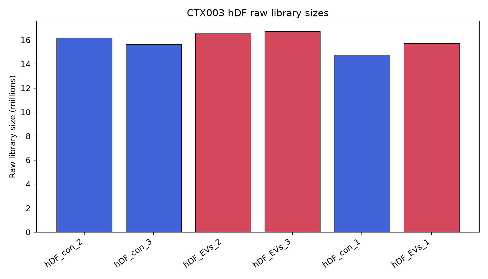
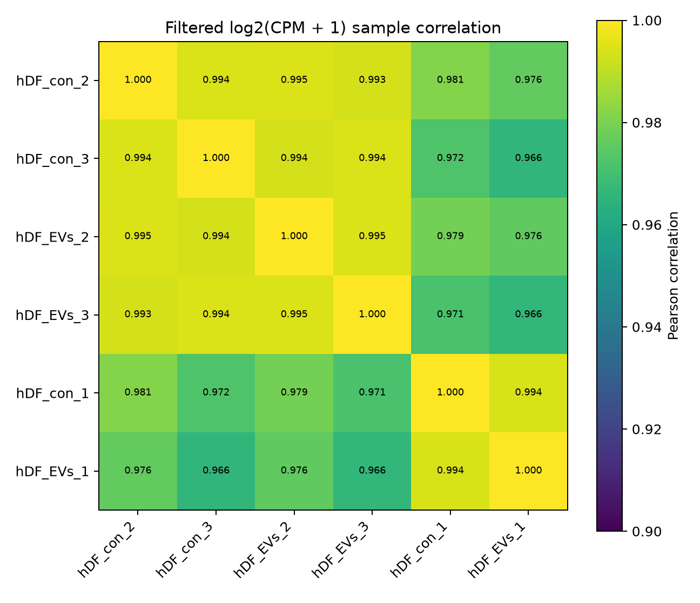
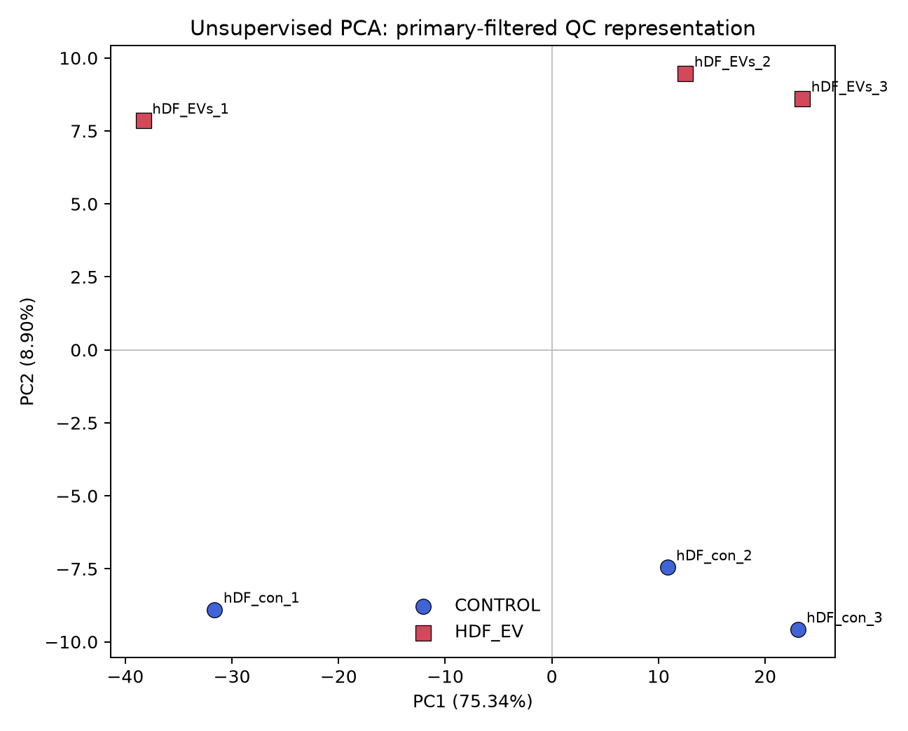
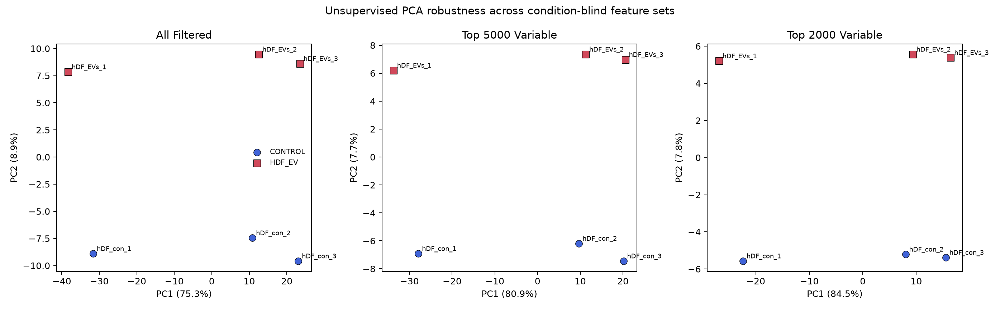

# SkinExo-AI EXP003-C2

## Objective

Perform unsupervised sample-level QC for the six CTX003 human dermal fibroblast RNA-seq libraries and freeze the differential-expression, pathway, third-context validation, phenotype-anchor, and reliability rules before examining biological DE results.

No DESeq2 model, GSEA, ORA, CTX003 response assignment, or biological cross-context comparison was run in C2.

## C1 Input

The input is the unchanged official GEO file `data/raw/exp003/GSE293956_hDF_total_count.txt.gz`, SHA-256 `f30d382112d04c9e3f147fc350f8f58e6306da414a617b5cd4dd52c1fd8ec76d`.

C2 reused the exact C1 structural rule: remove only the single contiguous trailing block with a blank identifier and six blank/NA expression cells. The invariant checks reproduced 1,048,575 physical data rows, 60,675 valid biological gene rows, and 987,900 structural padding rows. Every nonblank gene identifier was retained at load time, including 29,470 all-zero biological genes. Library sums exactly match C1.

The six verified hDF libraries comprise three `HDF_EV` and three `CONTROL` samples. No HaCaT data were loaded.

## Filtering

The primary rule was frozen in `configs/exp003_c2_qc_plan.json` before PCA or correlation was computed:

> **CPM ≥ 1 in at least 3 of 6 samples**

It is library-size aware, requires expression in half of the libraries, and does not use condition labels. CPM denominators use raw column sums across all 60,675 valid rows.

| Candidate rule | Primary | Genes retained | Genes removed |
| --- | ---: | ---: | ---: |
| CPM ≥ 0.5 in at least 3 | No | 15,504 | 45,171 |
| CPM ≥ 1 in at least 2 | No | 14,235 | 46,440 |
| CPM ≥ 1 in at least 3 | **Yes** | **13,874** | **46,801** |
| CPM ≥ 2 in at least 3 | No | 12,393 | 48,282 |

The alternatives are descriptive. The primary rule was not selected to maximize treatment/control separation. It is also the frozen C3 DE testing filter.

## Library QC

All metrics below were computed on the 60,675 valid rows before low-expression filtering. Quantiles include zeros; the median is calculated over nonzero counts only.

| Sample | Condition | Raw library size | Detected genes | Zero fraction | Median nonzero | Q90 | Q95 | Q99 | Maximum |
| --- | --- | ---: | ---: | ---: | ---: | ---: | ---: | ---: | ---: |
| hDF_con_2 | CONTROL | 16,185,815 | 23,672 | 0.609856 | 40 | 380 | 919.0 | 3,813.6 | 711,050 |
| hDF_con_3 | CONTROL | 15,651,359 | 23,532 | 0.612163 | 41 | 361 | 869.0 | 3,625.8 | 704,272 |
| hDF_EVs_2 | HDF_EV | 16,580,504 | 23,344 | 0.615262 | 45 | 398 | 946.3 | 3,940.1 | 665,681 |
| hDF_EVs_3 | HDF_EV | 16,735,394 | 23,364 | 0.614932 | 44 | 388 | 936.0 | 3,952.3 | 669,346 |
| hDF_con_1 | CONTROL | 14,756,355 | 23,322 | 0.615624 | 42 | 359 | 870.3 | 3,536.9 | 677,814 |
| hDF_EVs_1 | HDF_EV | 15,728,751 | 23,851 | 0.606906 | 40 | 382 | 950.0 | 3,853.0 | 705,251 |

Raw library size spans 14.76–16.74 million counts, a maximum/minimum ratio of 1.134. Detected genes span 23,322–23,851 and zero fractions span 0.607–0.616. No sample meets the frozen library-size or detected-gene review criterion.

## Sample Correlation

The QC representation is `log2(CPM + 1)` over the 13,874 primary-filtered genes. This is distinct from the future raw-count DE model. Pearson correlations were calculated without using condition labels; labels were used only for descriptive summaries.

| Pair category | Pairs | Mean | Minimum | Maximum |
| --- | ---: | ---: | ---: | ---: |
| Within EV | 3 | 0.978989 | 0.966400 | 0.994895 |
| Within control | 3 | 0.982743 | 0.972395 | 0.994395 |
| Between conditions | 9 | 0.984708 | 0.965715 | 0.994686 |

No significance test was performed. Between-condition correlation is slightly higher on average than either within-condition summary, reflecting strong sample structure that does not reduce to condition labels. Every sample's mean off-diagonal correlation remains within the preregistered review range.

## PCA

PCA was fitted with samples as observations and primary-filtered `log2(CPM + 1)` genes as features. Feature centering was applied; genes were not scaled to unit variance. Condition labels did not enter fitting or feature selection and were added only after coordinates were fixed.

- PC1: **75.3412%** of variance.
- PC2: **8.9002%** of variance.

PC1 separates the two replicate-1-labeled libraries from the four replicate-2/3-labeled libraries. This is a strong latent pattern, but replicate numbering is not authoritative evidence of donor, pairing, or batch. After fitting, condition annotation shows all three EV samples on the positive side of PC2 and all three controls on the negative side. That descriptive separation is not a significance test, phenotype validation, or reason to change the frozen design.

## PCA Robustness

PCA was repeated with all primary-filtered genes, the top 5,000 genes by across-sample variance, and the top 2,000 by across-sample variance. Feature selection remained condition blind.

| Feature set | Genes | PC1 | PC2 | Distance-rank correlation with all-filtered |
| --- | ---: | ---: | ---: | ---: |
| All filtered | 13,874 | 75.3412% | 8.9002% | 1.0000 |
| Top 5,000 variable | 5,000 | 80.8977% | 7.7141% | 1.0000 |
| Top 2,000 variable | 2,000 | 84.4554% | 7.7969% | 0.9857 |

The geometry is stable: the dominant latent split and secondary condition-labeled separation recur in all three representations. No sample has a two-dimensional nearest-neighbor distance greater than three times the median in two or more feature sets. The structure is therefore not dominated by one isolated library under the frozen criterion.

## Outlier Review

Every library was evaluated symmetrically using raw library size, detected genes, mean sample correlation, and PCA position. No library was excluded automatically.

| Sample | Condition | Status | Review flags |
| --- | --- | --- | --- |
| hDF_con_1 | CONTROL | NO_OBVIOUS_ISSUE | None |
| hDF_con_2 | CONTROL | NO_OBVIOUS_ISSUE | None |
| hDF_con_3 | CONTROL | NO_OBVIOUS_ISSUE | None |
| hDF_EVs_1 | HDF_EV | NO_OBVIOUS_ISSUE | None |
| hDF_EVs_2 | HDF_EV | NO_OBVIOUS_ISSUE | None |
| hDF_EVs_3 | HDF_EV | NO_OBVIOUS_ISSUE | None |

No corruption, identity failure, exact duplication, count-integrity problem, or isolated technical anomaly was found. The unexplained two-cluster PC1 structure is retained as a cohort-level design limitation.

## Batch Assessment

Authoritative metadata identifies no sample-level batch variable. Batch status is **NOT_DOCUMENTED**. Sample numbering, GSM order, matrix order, and PCA location were not converted into a batch label. The primary model therefore contains no batch term.

## Pairing Assessment

Authoritative metadata does not establish pairing. Pairing status is **NO_EVIDENCE / UNKNOWN**. Names such as `con_1` and `EVs_1` do not establish a shared donor, culture, preparation, or experimental block. The primary model contains no pairing term.

## Frozen DE Plan

The full preregistration is in `docs/checkpoints/EXP003_C2_ANALYSIS_PLAN.md`.

- Framework: DESeq2.
- Design: `~ condition`.
- Input: official raw integer counts after CPM ≥ 1 in at least 3 samples.
- Contrast: `HDF_EV` versus `CONTROL`.
- Positive log2FC: higher expression in hDF-EV-treated hDF.
- Inference: standard DESeq2 count model, dispersion estimation, Wald test, Benjamini–Hochberg adjustment, and standard result-level independent filtering.
- Threshold A: `padj < 0.05`.
- Threshold B: `padj < 0.05 AND |log2FC| >= 1`.

No condition model was fitted in C2.

## Frozen Pathway Plan

Future C4 uses **MSigDB 2026.1.Hs** GO Biological Process, Reactome, and Hallmark. Preranked GSEA over the DESeq2 Wald statistic is primary; ORA is secondary/supportive only. Existing P/M/E/A/I definitions, exact term map, 15–500 gene-set size rule, leading-edge coherence rule, and established project gene-set files/checksums are fixed before C3.

No GSEA or ORA was run in C2.

## Third-Context Validation Questions

The endpoints in `docs/checkpoints/EXP003_VALIDATION_ENDPOINTS.md` are frozen:

- **P:** test whether candidate conserved-component evidence persists without declaring the whole axis universally conserved.
- **M:** test whether CTX003 supports either prior direction, another context-dependent pattern, discordance, or null/not-testable evidence.
- **E:** test whether CTX003 supplies qualified evidence where CTX001 versus CTX002 was `NULL_NOT_TESTABLE`.
- **A:** test support for either prior context, renewed discordance/context dependence, or null evidence.
- **I:** distinguish exact component recurrence from broad axis overlap through a different component, discordance, or no evidence.

CTX003 is not required to validate either prior context.

## Phenotype Anchor Rules

The hDF CCK-8 and scratch assays are 24 h functional evidence; the transcriptome is 72 h. These assays may support plausibility but cannot serve as identical-timepoint transcriptomic validation. Mouse wound closure, scar, and collagen outcomes remain an `IN_VIVO` layer in a different model and species. They do not validate hDF transcriptomic response states.

## Reliability Limitations

- n = 3 libraries per condition.
- Recipient donor count and donor-to-library mapping: `UNKNOWN`.
- Independent EV preparation count and preparation-to-library mapping: `UNKNOWN`.
- Pairing: `NO_EVIDENCE / UNKNOWN`.
- Batch: `NOT_DOCUMENTED`.
- Exact RNA-seq control medium and vehicle: `UNKNOWN`.
- PC1 contains a stable, dominant, unexplained two-cluster pattern.
- No donor-level or EV-preparation-level generalization.

These limits remain regardless of the strength of future DE or pathway results.

## C2 Decision

**PASS WITH LIMITATIONS.** All six samples remain technically interpretable, no critical matrix or sample-level QC failure is present, and a defensible `~ condition` design has been frozen. The conclusion is limited by three libraries per arm, unknown donor and EV-preparation structures, undocumented pairing and batch, unknown control medium/vehicle, and unexplained dominant PC1 structure.

CTX003 remains `PLANNED`. Its P/M/E/A/I transcriptomic response rows remain `UNKNOWN`, and no CTX003 biological comparison has been created.
