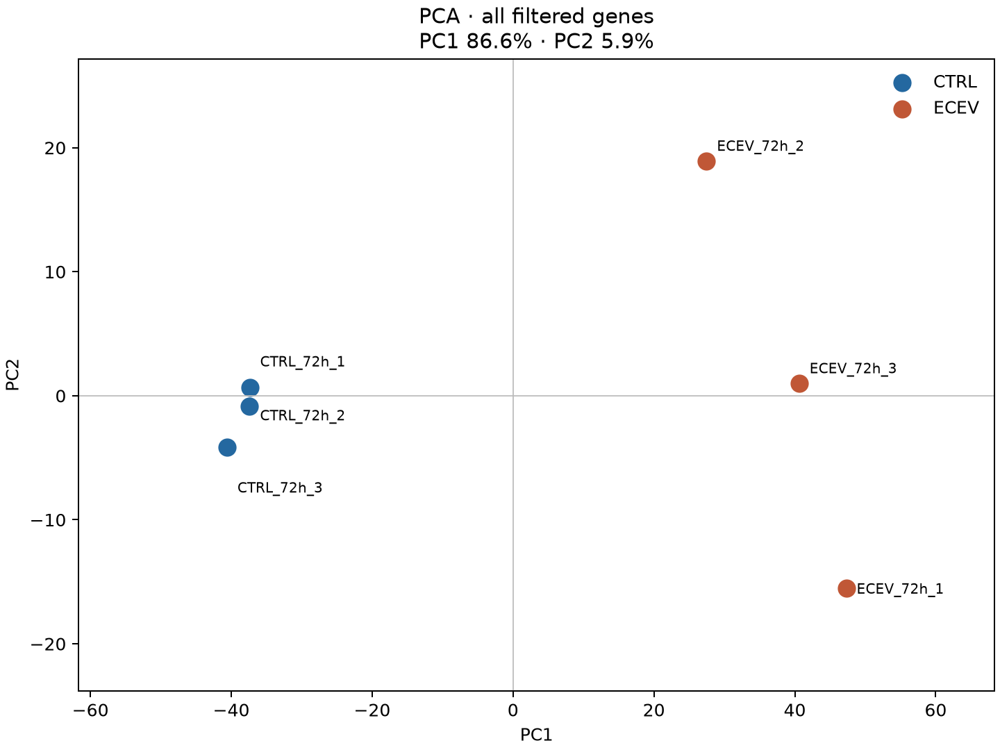
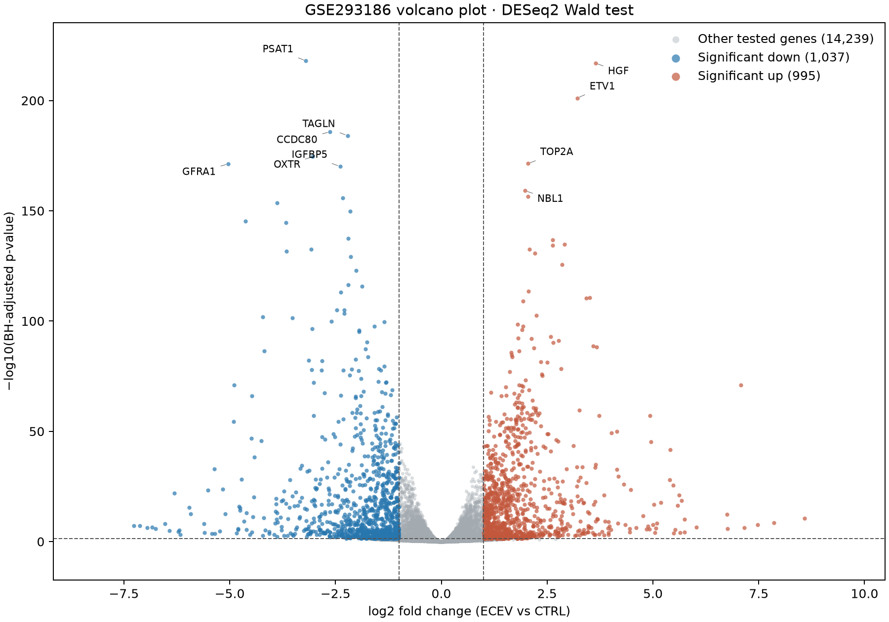
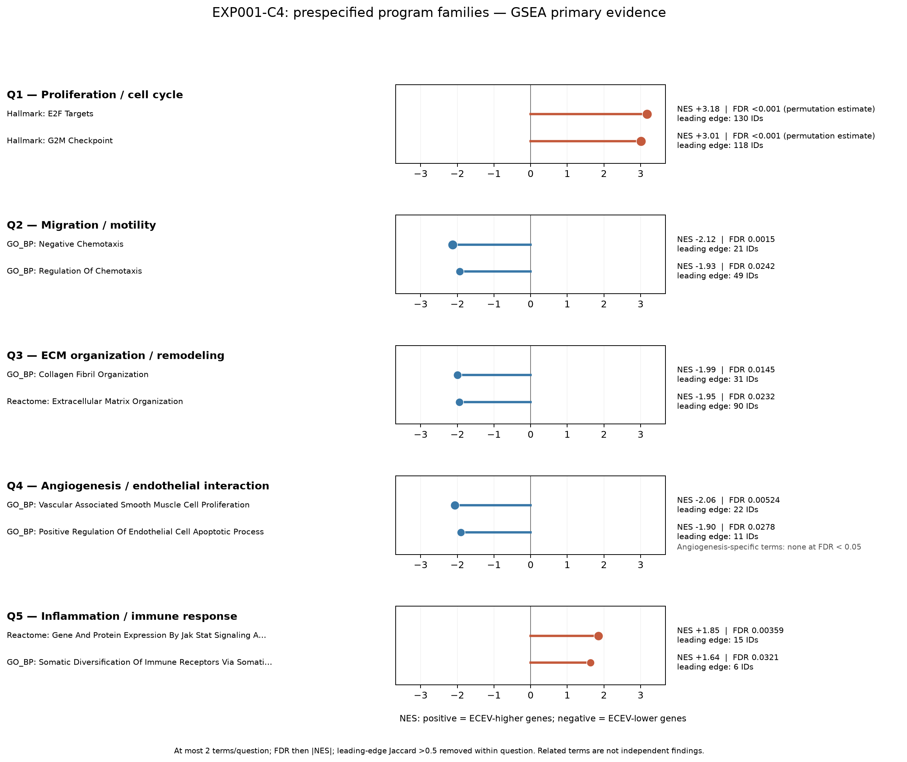

# SkinExo-AI

**Draft for participant review. This is not a submitted Kaggle Writeup.**

## Why this problem matters

Extracellular vesicles (EVs) can transmit molecular signals between cells, but connecting an EV source to a recipient skin-cell response and ultimately to repair outcomes requires evidence across different assays and models. SkinExo-AI is building an auditable chain from molecular observations to biological claims.

## Our approach

We started with a single public fibroblast RNA-seq comparison and completed dataset integrity checks (C1), sample-level quality assessment (C2), count-based differential expression (C3), a source-verified literature/dataset framework (C3.5), and prespecified pathway analysis (C4). Predictive components remain planned.

## Data

[NCBI GEO GSE293186](https://www.ncbi.nlm.nih.gov/geo/query/acc.cgi?acc=GSE293186): primary human dermal fibroblasts at 72 hours, three CTRL samples and three endothelial-cell-derived EV (ECEV) samples. The official gene-count matrix is the analysis input. The source study's DEG table is used only for analytical concordance, after our result was generated. Raw archives remain outside the public repository.

## What we have demonstrated

- **C1:** 58,735 gene rows and six biological samples; zero missing values, negative counts, or duplicate gene IDs.
- **C2:** An unsupervised CPM ≥ 1 in at least two samples filter retained 14,755 genes for sample QC. Mean within-group Pearson correlations were 0.9961 (CTRL) and 0.9923 (ECEV); between-group mean was 0.9532. PCA PC1/PC2 explained 86.59%/5.90%. These are exploratory descriptions.
- **C3:** DESeq2 tested 16,271 genes; 2,032 met adjusted p < 0.05 and |log2FC| ≥ 1 (995 higher and 1,037 lower in ECEV). Agreement with the source study's thresholded DEG table was high among shared genes, but it uses the same dataset and is not independent validation.
- **C3.5:** 16 literature records verified, nine primary research/methods records, seven reviews, and four public datasets cataloged. Evidence gaps remain explicit.
- **C4:** All 16,271 C3-tested genes were ranked by DESeq2 Wald statistic. GO Biological Process, Reactome, and Hallmark yielded 4,600 eligible sets; 640 had GSEA FDR < 0.05. GSEA is primary and ORA secondary. The strongest predefined association was an ECEV-higher **cell-cycle transcriptional program** (Hallmark E2F Targets NES +3.18; G2M Checkpoint +3.01; estimated FDR < 0.001). Mapped chemotaxis and ECM terms tended toward ECEV-lower genes. Vascular/endothelial and immune annotations were also represented, but no angiogenesis-named term reached GSEA FDR < 0.05. These are transcriptomic associations, not measured repair phenotypes. Separate external regenerative-like and fibrotic-like signatures are still needed for Q6.

*Samples are observations. PCA uses filtered log2(CPM + 1) without condition labels during fitting; separation is descriptive, not proof of causality.*

*DESeq2 ECEV-versus-CTRL result. Color denotes adjusted p < 0.05 and |log2FC| ≥ 1, not validated repair function.*

*GSEA NES, estimated FDR, and leading-edge size for selected predefined terms. At most two terms per question are shown using a documented redundancy rule; full results are available in the C4 tables. Related GO terms are not independent findings.*

## SkinExo Evidence Framework

The current map records EV source → cargo → recipient cell → molecular response → P/M/E/A/I program → regenerative/fibrotic context → phenotype, with study IDs and evidence classes. Study-level direct evidence counts in the screened set are P=3, M=2, E=3, A=0, I=2. The zero for angiogenesis reflects missing direct measurement in the screened studies. C4 [integrates](../outputs/exp001/c4_evidence_integration.csv) ranked pathway associations with these literature counts, without treating enrichment as phenotype validation. Reviews are synthesis rather than independent experiments. The [full matrix](../data/metadata/skinexo_evidence_matrix.csv) and [C4 report](../reports/EXP001_C4_pathway_analysis.md) document the coding and interpretation.

## Reproducibility

The repository contains checkpoint scripts, reports, metadata, the exact Python package list, and the R/DESeq2 package manifest. Official source archives can be retrieved from GEO using [data provenance](../docs/compliance/DATA_PROVENANCE.md); raw data are ignored by Git. [Technical report](technical_report.md) details the design and thresholds.

## Current limitations

This is one bulk RNA-seq dataset with three biological replicates per condition. PCA, DE, and enrichment do not demonstrate wound-healing benefit. Author-table concordance is same-dataset consistency. Literature models and EV sources vary, and 17 of 19 inspected C3 genes lacked sufficient gene-specific evidence in this scoped literature set. GSEA terms overlap and pathway labels may not match a fibroblast phenotype; Q6 was not tested. No independent validation or predictor is available.

## Next steps

> **TODO — Cross-dataset validation:** Evaluate compatible external EV-response data with documented model differences.
>
> **TODO — Predictive AI:** Design, train, and test a model before claiming capability or performance.
>
> **TODO — Demo:** Record and review a video after deciding which completed results can be shown.
