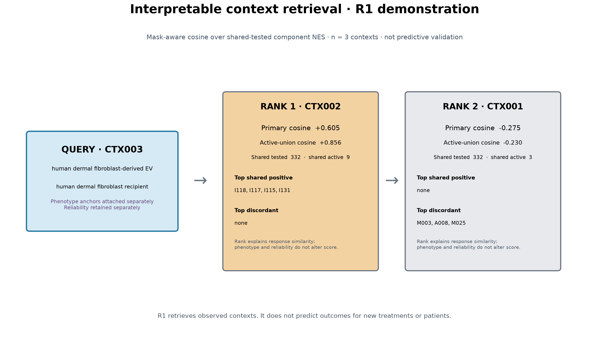

# SkinExo-AI: A Context-Aware Extracellular-Vesicle Response Platform

SkinExo-AI transforms isolated extracellular-vesicle studies into a context-aware response atlas that retrieves and explains conserved, context-dependent, discordant, and uncertain cellular responses.

## The Problem

Extracellular-vesicle (EV) studies are usually analyzed in isolation. Differences in EV source, recipient cell, dose, duration, study design, and evidence layer make their biological responses difficult to compare. Broad pathway labels can also hide a crucial distinction: two contexts may involve the same biological axis while different response components drive the evidence.

We tested whether a broad EV-associated fibroblast response generalized across three public study contexts. It did not. That negative result is the reason SkinExo-AI represents response in context instead of assuming a generic EV signature.

## Our Solution

SkinExo-AI v0.3 combines:

1. a reproducible transcriptomic evidence engine;
2. context normalization;
3. a three-context Response Atlas;
4. a 339-component response representation;
5. explicit evidence and missingness states;
6. dimension-level reliability metadata;
7. mask-aware, interpretable retrieval;
8. deterministic WHY explanations;
9. separate phenotype anchors and provenance; and
10. an offline Streamlit Explorer.


## How It Works

```text
Public EV studies
        ↓
Reproducible analysis + context normalization
        ↓
Component-level Response Atlas
        ↓
Evidence states + reliability + provenance
        ↓
Mask-aware retrieval + WHY explanations
        ↓
Offline interactive Explorer
```

The Atlas distinguishes `ACTIVE_POSITIVE`, `ACTIVE_NEGATIVE`, `OBSERVED_NULL`, `NOT_TESTED`, and `UNKNOWN`. An observed null means a component was tested but did not qualify as active. It is not missing evidence.

## Three Independent Contexts

| Context | Dataset | EV source → recipient | Duration |
|---|---|---|---:|
| CTX001 | GSE293186 | Endothelial-cell-derived EV → primary human dermal fibroblast | 72 h |
| CTX002 | GSE251807 | Bone-marrow MSC small EV → primary human dermal fibroblast | 48 h |
| CTX003 | GSE293956 | Human dermal fibroblast-derived EV → human dermal fibroblast | 72 h |

The studies are independent at the study level. Donor and EV-preparation independence are incomplete or unknown and are not implied.

## What We Found

**Broad universal EV transcriptomic response: NOT SUPPORTED.**

- **P — Proliferation / Cell Cycle:** one shared component in CTX001 and CTX002 did not extend to CTX003. This is a two-context result, not universal conservation.
- **M — Migration / Motility:** context-dependent and discordant.
- **E — ECM Organization / Remodeling:** null/not testable in the three-context interpretation.
- **A — Vascular / Endothelial Interaction:** context-dependent and discordant. This does not demonstrate angiogenesis.
- **I — Inflammation / Immune Signaling:** conserved broad axis with context-varying component structure. CTX002 and CTX003 share exact components; CTX001 shares broader axis direction through different components.

CTX003 provided the strongest validation test. The P hypothesis was defined before the third-context result, and CTX003 returned `OBSERVED_NULL` across the frozen P mapping. SkinExo-AI preserved the failed generalization instead of changing the question after seeing the result.

## Context-Aware Response Atlas

Atlas F2-2026-10-01 contains:

- **3** verified contexts;
- **5** response axes;
- **339** stable response components;
- **1,017** context-component records;
- **139** active positive;
- **19** active negative;
- **852** observed null;
- **7** not tested; and
- **0** unknown.


The axis summary makes the Atlas readable, while component records preserve the evidence needed for comparison. Same axis does not automatically mean same component.

## Interpretable Retrieval

R1 uses **mask-aware NES cosine** over components tested in both contexts. `NOT_TESTED` and `UNKNOWN` are excluded rather than imputed as biological zero. A secondary active-union cosine reduces domination by jointly null components. Reliability and phenotype evidence are attached after retrieval and do not enter the similarity score.

| Context pair | Response similarity |
|---|---:|
| CTX001–CTX002 | −0.1749 |
| CTX001–CTX003 | −0.2755 |
| CTX002–CTX003 | +0.6053 |

For CTX002–CTX003, active-union cosine is +0.8563 with 9 shared active components and directional concordance 1.000. These are descriptive retrieval metrics, not accuracy, AUC, or prediction performance.



The WHY engine exposes shared positive and negative components, discordant components, query-only and target-only activity, observed-null differences, and axis-specific evidence. The examples are generated by deterministic rules rather than hand-picked for the story.

## Interactive Explorer

The Streamlit 1.64.0 Explorer A2 lets a judge:

- select CTX001, CTX002, or CTX003;
- inspect experimental context and missing metadata;
- explore P/M/E/A/I response components;
- retrieve the other contexts;
- open WHY explanations;
- inspect phenotype anchors and reliability dimensions; and
- trace evidence to provenance.

The default CTX003 query computes CTX002 as rank 1 at +0.6053 and CTX001 as rank 2 at −0.2755. The Explorer runs offline from tracked derived artifacts. It requires no raw omics, licensed PDF, institutional network, or internet at runtime.

## Validation & Reliability

The validation sequence includes EXP001 internal analytical reproducibility, EXP002 independent-study validation and sensitivity analysis, a prospectively frozen EXP003 third-context test, F1/F2 schema validation, seven retrieval sanity tests, and **22/22 passing repository tests**, including retrieval and Explorer checks.

Reliability stays dimension by dimension. Key limits include small samples, incomplete or unknown donor and EV-preparation independence, batch/pairing/control uncertainty where applicable, unexplained CTX003 PC1 structure, and phenotype time/model mismatch. No aggregate confidence percentage hides these limitations.

## Reproducibility

The project records frozen analysis plans, the MSigDB 2026.1.Hs release, Git checkpoints, source hashes, provenance, scripts, full derived tables, tests, and project-generated figures. The MIT-licensed original source and derived public artifacts are published on the `public-v1` branch at https://github.com/silver131-dev/SkinExo-AI. Third-party datasets and resources retain their original licenses and terms.

## Impact

SkinExo-AI helps researchers compare fragmented EV evidence, trace why contexts agree or differ, preserve negative findings, and prioritize follow-up experiments. It is a research-support platform. It does not establish clinical impact or therapeutic efficacy.

## Limitations

Only three contexts are represented. CTX001 and CTX003 have n=3 per condition. Study-level independence does not establish independent-donor or independent EV-preparation replication. Transcriptomic pathways are not phenotypes, and CTX003’s 24-hour CCK-8 and scratch anchors differ from its 72-hour RNA-seq timepoint. Mouse wound, scar, and collagen evidence uses a different model. Retrieval is descriptive and is not predictive validation.

SkinExo-AI does not include a trained predictive model, foundation model, digital twin, agent, therapeutic predictor, or causal cargo-response model.

**Maturity boundary:** TODAY, observed Response Atlas and observed-context retrieval are implemented. NEXT, evidence-guided EV candidate screening is future work for experimental validation and is not currently implemented. FUTURE response prediction requires a larger Atlas, modeling, and prospective validation and is not yet implemented. The Skin–EV Response Digital Twin is a LONG-TERM VISION, not an implemented or clinical capability.

## Demo

Final demo video (04:58.48; unlisted): https://youtu.be/optVRKKDNec

## Code

https://github.com/silver131-dev/SkinExo-AI

## Technical Report

https://github.com/silver131-dev/SkinExo-AI/blob/public-v1/submission/technical_report.md
